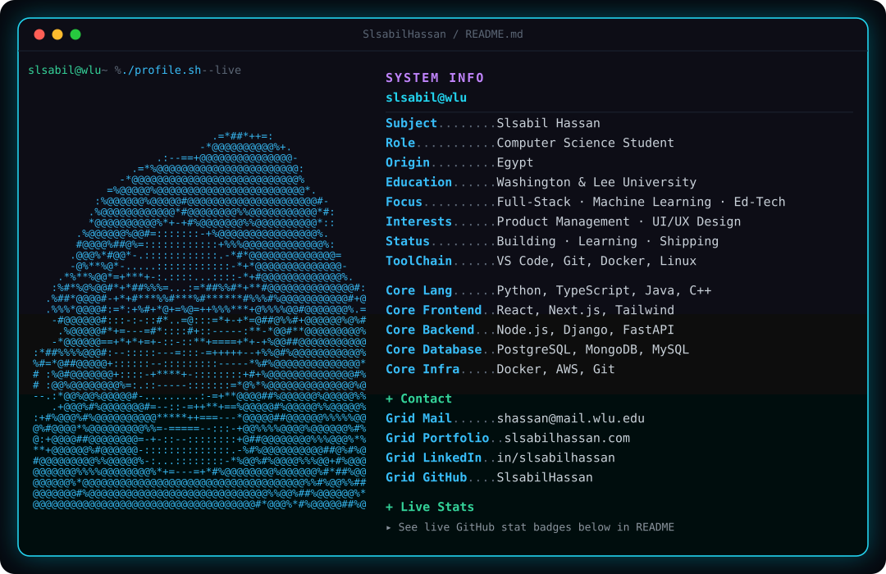

<!-- ═══════════════ NEOFETCH TERMINAL CARD ═══════════════ -->
<div align="center">
<a href="https://github.com/SlsabilHassan">
<picture>
  <source media="(prefers-color-scheme: light)" srcset="./light.svg"/>
  
</picture>
</a>
</div>

<br/>

<!-- ═══════════════ SOCIAL BADGES ═══════════════ -->
<div align="center">

<a href="https://slsabilhassan.com"></a>
<a href="https://linkedin.com/in/slsabilhassan"></a>
<a href="mailto:shassan@mail.wlu.edu"></a>


</div>

<br/>


## 🛠️ Tech Arsenal

<div align="center">

**Languages**


**Frontend**


**Backend & APIs**


**Data Science & ML**


**Databases, DevOps & Tools**


**🖌️ Product & Design**

&nbsp;
&nbsp;


</div>

<br/>


## 🚀 Featured Projects

<table>
<tr>
<td width="50%" valign="top">

<h3 align="center">🎓 DS Learning Platform</h3>
<p align="center">
<a href="https://github.com/SlsabilHassan/DS-Cyber-Educational-Tool"></a><br/><br/>


</p>

An **ed-tech platform** that teaches data structures interactively — 8 modules, 64 auto-graded challenges, and **Python running in the browser** via Pyodide (WebAssembly). Built as faculty-supervised research.

`Next.js 16` `React 19` `TypeScript` `WebAssembly`

</td>
<td width="50%" valign="top">

<h3 align="center">🧠 Resume ATS Analyzer</h3>
<p align="center">
<a href="https://github.com/SlsabilHassan/Resume-Analyzer-ATS-Score-Predictor"></a><br/><br/>


</p>

NLP engine that scores resumes against job descriptions like a real ATS — **hybrid keyword + semantic embedding matching**, skill-gap detection, PDF/DOCX support, Streamlit UI.

`Sentence-Transformers` `Streamlit` `pdfplumber`

</td>
</tr>
<tr>
<td width="50%" valign="top">

<h3 align="center">🛒 Amazon Trust Predictor</h3>
<p align="center">
<a href="https://github.com/SlsabilHassan/ai4all_02D"></a><br/><br/>


</p>

ML system predicting Amazon purchase volume from ratings, reviews, badges & pricing — with SHAP explainability and a Trust Score calculator. Built through **AI4ALL**.

`scikit-learn` `pandas` `SHAP`

</td>
<td width="50%" valign="top">

<h3 align="center">🎓 W&L Major Tracker</h3>
<p align="center">
<a href="https://github.com/SlsabilHassan/WLU_Major_Tracker"></a><br/><br/>


</p>

Interactive degree roadmap for **every major at W&L** — real-time completion tracking, persistent progress, particle animations. Built because tracking requirements by hand was pain.

`React 18` `TypeScript` `TSParticles`

</td>
</tr>
</table>

<br/>


## 📊 GitHub Analytics

<div align="center">


<br/><br/>


<br/><br/>


</div>

<br/>

<!-- ═══════════════ SNAKE ═══════════════ -->
<div align="center">

## 🐍 Watch the Snake Eat My Commits

<picture>
  <source media="(prefers-color-scheme: dark)" srcset="https://raw.githubusercontent.com/SlsabilHassan/SlsabilHassan/output/github-snake-dark.svg"/>
  <source media="(prefers-color-scheme: light)" srcset="https://raw.githubusercontent.com/SlsabilHassan/SlsabilHassan/output/github-snake.svg"/>
  
</picture>

</div>

<br/>


## ⚡ Currently Executing

```python
>>> slsabil.status()
{
    "building":  "an ed-tech platform for learning CS concepts",
    "learning":  ["full-stack systems", "ML that ships to real users"],
    "open_to":   ["internships", "research collabs", "cool projects"],
    "fun_fact":  "my Flappy Bird AI has a better high score than I do",
}
```

<br/>

## 📬 Let's Build Something

<div align="center">

Always down to talk **software, ML, ed-tech** — or anything worth building.

<br/>

<a href="https://slsabilhassan.com"></a>
<a href="https://linkedin.com/in/slsabilhassan"></a>
<a href="mailto:shassan@mail.wlu.edu"></a>
<a href="mailto:slsabilhassan1@gmail.com"></a>

<br/><br/>

### `"Programs must be written for people to read, and only incidentally for machines to execute."`


</div>
